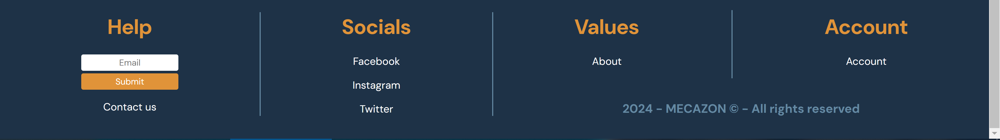
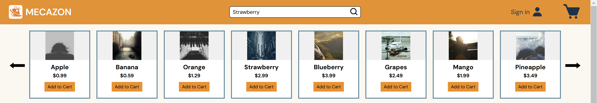

### Ethan's Contribution to Team B's react code

Ethan worked on the footer, the API connections, the shopping cart, and the carousel.
He was also our team leader and helped most of us with what we'd be working on, as well as looking at all our code and putting his own revisions on it to make the site more cohesive.

## Footer Contribution

# Footer.jsx component

```js
import styles from "../styles/Footer.module.css";

export default function Footer() {
  return (
    <div className={styles.background}>
      <div className={styles.row}>
        <div className={styles.column}>
          <h1>Help</h1>
          <input
            className={styles.emailInput}
            type="email"
            name=""
            id=""
            placeholder="Email"
          />
          <button className={styles.submitBtn}>Submit</button>
          <p>Contact us</p>
        </div>
        <div className={styles.divider}></div>
        <div className={styles.column}>
          <h1>Socials</h1>
          <div className={[styles.dataColumn]}>
            <a
              href="https://www.facebook.com/westmec/"
              className={styles.socials}
            >
              Facebook
            </a>
            <a
              href="https://www.instagram.com/westmec_cccoding/"
              className={styles.socials}
            >
              Instagram
            </a>
            <a href="https://twitter.com/westmec" className={styles.socials}>
              Twitter
            </a>
          </div>
        </div>
        <div className={styles.divider}></div>
        <div className={styles.column_spaced}>
          <div className={styles.row_spaced}>
            <div className={styles.column}>
              <h1>Values</h1>
              <a href="/" className={styles.socials}>
                About
              </a>
            </div>
            <div className={styles.divider_spaced}></div>
            <div className={styles.column}>
              <h1>Account</h1>
              <a href="/" className={styles.socials}>
                Account
              </a>
            </div>
          </div>
          <div className={styles.copyrights}>
            <h3>2024 - MECAZON &copy; - All rights reserved</h3>
          </div>
        </div>
      </div>
    </div>
  );
}
```



## API Connections Contribution

# GroceryList.jsx component

```js
 {
    setModalData(i);
  }}
  src={"https://picsum.photos/seed/" + i.name + "/200/200.jpg"}
  alt={i.name}
  draggable="false"
/>
```

## Shopping Cart Contribution

# ShoppingCart.jsx page

```js
import { useState, useEffect } from "react";
import styles from "../styles/ShopingCart.module.css";
// import axios from "axios";

export default function ShoppingCart() {
  const [cart, setCart] = useState([]);
  const [total, setTotal] = useState(0);
  const [tax, setTax] = useState(0.08);

  useEffect(() => {
    const response = JSON.parse(localStorage.getItem("cart"));
    setCart(response);
  }, []);

  useEffect(() => {
    let total = 0;
    (cart || [])?.map((i) => {
      total += i.price;
    });
    setTotal(() => (parseFloat(total) + parseFloat(total) * tax).toFixed(2));
  }, [cart, tax]);

  return (
    <>
      <h1>Shopping Cart</h1>
      <div className={styles.container}>
        <div className={styles.row}>
          <div className={styles.items}>
            {((cart ? cart.length : 0) !== 0
              ? cart
              : [{ name: "Your Cart is empty" }]
            ).map((i) => (
              <div className={styles.item} key={Math.random()}>
                
                <h1 className={styles.text}>{i.name}</h1>
                <h1 className={styles.text}>
                  {i.price ? "$" : ""}
                  {i?.price}
                </h1>
                {i.price ? (
                  <button
                    className={styles.closeBtn}
                    onClick={() => {
                      let Index = cart.indexOf(i);
                      if (Index != -1) {
                        let cart = JSON.parse(localStorage.getItem("cart"));
                        cart.splice(Index, 1);
                        localStorage.setItem("cart", JSON.stringify(cart));
                        setCart(cart);
                      }
                    }}
                  >
                    ✖
                  </button>
                ) : (
                  <></>
                )}
              </div>
            ))}
          </div>
          <div className={styles.items}>
            <h1>Checkout</h1>
            {(cart || [{ name: "Your Shopping Cart is Empty" }])?.map((i) => {
              return (
                <div className={styles.listing} key={Math.random()}>
                  <h1 className={styles.text}>{i.name}</h1>
                  {i.price ? (
                    <h1 className={styles.text}>${i?.price}</h1>
                  ) : (
                    <></>
                  )}
                </div>
              );
            })}
            {cart ? (
              <>
                <div className={styles.listing}>
                  <h1 className={styles.text}>Tax: </h1>
                  <h1 className={styles.text}>{tax * 100}%</h1>
                </div>
                <div className={styles.listing}>
                  <h1 className={styles.text}>Total: </h1>
                  <h1 className={styles.text}>
                    {total == 0 ? "Free" : `$${total}`}
                  </h1>
                </div>
              </>
            ) : (
              <></>
            )}
            <button
              onClick={() => {
                localStorage.cart = "[]";
                setCart([]);
                alert("Thanks for shopping with us!");
              }}
            >
              Checkout
            </button>
          </div>
        </div>
      </div>
    </>
  );
}
```

## Carousel Contribution

# Carousel.jsx component

```js
import GroceryList from "./GroceryList";
import addToCartFunc from "./AddToCartBtn";
import styles from "../styles/Carousel.module.css";
import { useEffect, useState } from "react";

export default function Carousel({ count, data, setModalData }) {
  const [index, setIndex] = useState(0);
  // const [data, setdata] = useState([]);

  function incrementIndex(num) {
    const next_num = index + num;
    if (next_num < 0) {
      setIndex(0);
    } else if (next_num > data.length - count) {
      setIndex(data.length - count);
    } else {
      setIndex(next_num);
    }
  }

  return (
    <div className={styles.row}>
      <button
        className={styles.btn}
        onClick={() => {
          incrementIndex(-count);
        }}
      >
        ⬅
      </button>
      <div className={styles.items}>
        {data.slice(index, index + count).map((i) => (
          <div className={styles.item} key={i.id}>
            {/* src="https://avatars.githubusercontent.com/u/131179727?s=200&v=4" */}
             {
                setModalData(i);
              }}
              src={"https://picsum.photos/seed/" + i.name + "/200/200.jpg"}
              alt=""
            />
            <div className={styles.subitem}>
              <h1 className={styles.text}>{i.name}</h1>
              <h1 className={styles.price}>${i.price}</h1>
              <button
                onClick={() => {
                  addToCartFunc(i);
                }}
                className={styles.addToCartBtn}
              >
                Add to Cart
              </button>
            </div>
          </div>
        ))}
      </div>
      <button
        className={styles.btn}
        onClick={() => {
          incrementIndex(count);
        }}
      >
        ➡
      </button>
    </div>
  );
}
```


