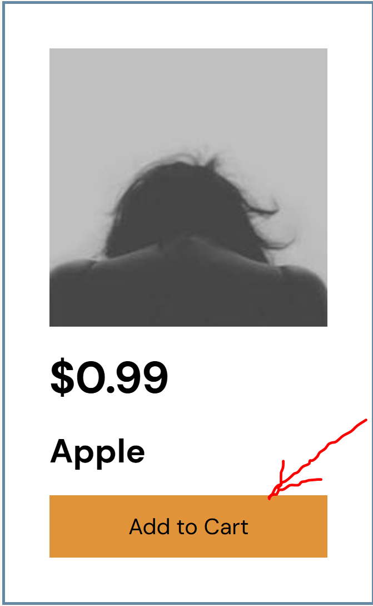
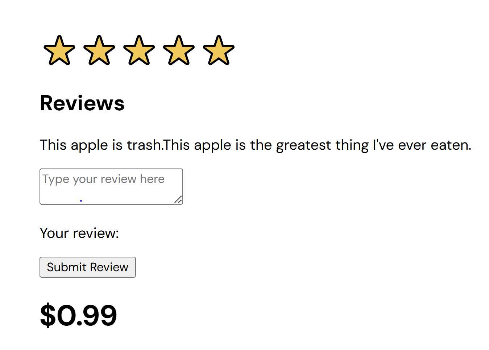

### Isaac's Contribution to Team B's react code

I contributed mostly to the shopping cart functionality especially, and also the modal functionality as well.
On top of that, I helped with organizing the file structure of the react files such as pages and components.

## Shopping Cart Contribution

I worked on this logic for a couple of days, and eventually got Mr. Morales's and Ethan's help to make it completely functional.
Ethan eventually optimized the logic to look the way it does now, but the functionality was our work.

# AddToCartBtn.jsx component

```js
export default function SaveItem(Item) {
  if (Item != null) {
    return localStorage.setItem(
      "cart",
      JSON.stringify([
        ...(JSON.parse(localStorage.getItem("cart")) || []),
        Item,
      ])
    );
  }
}
```



The code itself for adding an item to the shopping cart is referenced in the GroceryList.jsx component, which I also modified heavily to get the shopping cart working properly. You can see the button that references the SaveItem/AddToCartBtn component on line 30.

# GroceryList.jsx component

```js
import styles from "../styles/GroceryList.module.css";
import SaveItem from "../components/AddToCartBtn";

export default function GroceryList({ items, setModalData }) {
  return (
    <div className={styles.list}>
      {items.map((i) => (
        <div key={i.id} className={styles.item}>
           {
              setModalData(i);
            }}
            src={"https://picsum.photos/seed/" + i.name + "/200/200.jpg"}
            alt={i.name}
            draggable="false"
          />
          <div className={styles.description}>
            <h1 className={styles.text}>${i.price}</h1>
            <h2 className={styles.text}>{i.name}</h2>
            <button className={styles.btn} onClick={() => SaveItem(i)}>
              Add to Cart
            </button>
          </div>
        </div>
      ))}
    </div>
  );
}
```

The shopping cart page itself ended up being redesigned by my team, but I did contribute the initial design as well as the functionality that adds the purchased items to the shopping cart page.
The page itself is real lengthy, so I'll give the most important parts of it that I worked on.

# ShoppingCart.jsx page

```js
useEffect(() => {
  const response = JSON.parse(localStorage.getItem("cart"));
  setCart(response);
}, []);
// ~~~~~~~~~~~~~~~~~~~~~~~~~~~~~~~~~~~~~~~~~~~~~~~~~~~~~~~~
<button
  onClick={() => {
    localStorage.cart = "[]";
    setCart([]);
    alert("Thanks for shopping with us!");
  }}
>
  Checkout
</button>;
```

## Modal Contribution

# Modal.jsx component

Don't get me wrong, the entire modal component is all Myles's work, so full credit should go to him for the component itself.
However, I'd be remissed if I didn't say that about a day's worth of my work went into this page.
You see, I spoke lots with other teams' members making sure my team was facilitating their work just as much as our own.
Eventually, Levi came up to me and requested that I create a review functionality. I ended up getting it paritally functional.
However, the last peice of code to make it functional would be to modify the entire json data files that Levi and team D had created.
I left if up to Levi whether or not we should use this review functionality, and he ended up deciding that it wasn't the best feature to implement given the time crunch.
I did work hard on it though, and I thought I'd include it because it was a full day's worth of work for me. Here it is.

```js
function handleReview(event) {
  setReviewText(event.target.value);
}
function addReview() {
  console.log(reviewText);
  setModalData((prevObject) =>
    prevObject.reviews
      ? { ...prevObject, reviews: [...prevObject.reviews, reviewText] }
      : { ...prevObject, reviews: [reviewText] }
  );
  setReviewText("");
  console.log(data);
}
```

```js
<div>
  <h2>Reviews</h2>
  <p>{data.reviews}</p>
  <textarea
    value={reviewText}
    ref={reviewRef}
    placeholder={"Type your review here"}
    onChange={handleReview}
  ></textarea>
  <p>Your review: {reviewText}</p>
  <button onClick={addReview}>Submit Review</button>
</div>
```


